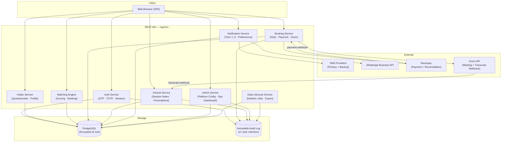

<!-- generated-by: gsd-doc-writer -->
# Architecture

## System Overview

The Mental Health Platform is a web-based telepsychiatry service for India. Patients register, complete a structured mental health intake questionnaire, are matched to a licensed psychiatrist from a partner agency, and book video sessions via Zoom. After each session, psychiatrists document care recommendations into the platform; the resulting structured care history drives personalised long-term notifications (medication reminders, activity nudges, follow-up prompts) delivered via WhatsApp. The platform serves four user roles — Patient, Psychiatrist, AgencyAdmin, and PlatformAdmin — each with strictly scoped access to data. The architecture is a modular, service-oriented REST API backend backed by PostgreSQL, with an event-driven notification layer for all asynchronous workflows. The system must handle 500 concurrent users at launch and scale to 5,000 without structural rewrites.

---

## Component Diagram



---

## Data Flow

A typical patient booking flows through the system as follows:

1. **Registration / Login** — The patient enters their mobile number; the Auth Service sends an OTP via the primary SMS provider (automatic failover to backup if no acknowledgement within 30 seconds). The verified OTP creates or restores an authenticated session.

2. **Intake** — The Intake Service presents a multi-section questionnaire. Progress is saved per section to PostgreSQL; a patient who exits can resume on next login. On final submission, a structured `PatientProfile` record is created and account status transitions from `incomplete-intake` to `active`.

3. **Matching** — The Matching Engine queries all eligible psychiatrists platform-wide, scores each against the patient's symptoms, severity, preferences (gender, language), availability, and rating percentile. Up to five ranked results are returned within five seconds. Results are returned in order of descending score; when all scores fall below the configured threshold the list is labelled "closest available."

4. **Slot Selection and Checkout** — The Booking Service performs a real-time availability check when the patient selects a slot. The slot is held for ten minutes (configurable). The patient completes payment via Razorpay. Booking confirmation uses a three-path strategy: (a) HMAC-SHA256 signature verification on the immediate Razorpay response, (b) an asynchronous Razorpay webhook, and (c) a reconciliation job that polls non-terminal orders older than ten minutes every fifteen minutes. On confirmed payment, the Booking Service calls the Zoom API (up to three retries) to create a meeting; if all retries fail, an automatic full refund is issued.

5. **Session** — The psychiatrist and patient join the Zoom meeting as external participants. Zoom sends a transcript webhook to the Clinical Service on meeting end. The Clinical Service generates a draft `CareRecommendation` from the transcript, surfaces it to the psychiatrist for review, and on approval appends it to the patient's permanent care record.

6. **Post-Session Notifications** — Approved care records trigger the Notification Service. Medication reminder schedules are created per patient-set reminder times. Follow-up nudges are queued for the recommended next-session date. All Tier 3 notifications are delivered over WhatsApp Business API, personalised per patient, bounded by the per-user daily cap (default: 3), and rescheduled immediately whenever the patient updates their preferences.

7. **Data Lifecycle** — The Data Lifecycle Service processes typed deletion jobs (on-demand, abandoned-account, and seven-year-expiry). Each job runs a two-phase pipeline: Phase 1 erases PII; Phase 2 anonymises clinical records by replacing patient identifiers with a pseudonymous ID. Every job produces an immutable, PII-free audit entry.

---

## Key Abstractions

| Abstraction | Description | Responsibility |
|---|---|---|
| `PatientProfile` | Normalised, structured record of intake responses, preferences, and care history | Source of truth for matching, clinical notes, and personalisation |
| `PsychiatristProfile` | Licensed clinician record including MCI registration number, specialisations, languages, and session fees | Queried by Matching Engine; scoped to one agency |
| `Agency` | Partner organisation entity with `agency_id` FK on `PsychiatristProfile` | Defines AgencyAdmin data isolation boundaries |
| `AvailabilitySlot` | Per-psychiatrist time slot with session type (`Initial Assessment`, `Follow-Up`, `Urgent Review`) and duration derived from `PlatformConfiguration` | Managed by psychiatrist and AgencyAdmin; enforces 3-month horizon and overlap rejection |
| `Appointment` | Confirmed booking linking patient, psychiatrist, slot, Zoom meeting, and payment | Central entity for clinical and billing workflows |
| `CareRecommendation` | Psychiatrist-approved session record (Form B-1 equivalent); includes medications, activities, follow-up date, symptom trajectory | Retained 7 years; visible to any psychiatrist with an active access window |
| `Prescription` | Formal e-prescription document; hard-blocks List C drugs; PDF stored and delivered to patient | Separate from CareRecommendation; retained 7 years |
| `Payment` | Razorpay order record with fee locked at booking time and GST invoice number | Immutable once confirmed; supports reconciliation job |
| `PlatformConfiguration` | Single admin-editable store of all platform-wide operational parameters | No hardcoded thresholds anywhere in the codebase |
| `DataLifecycleJob` | Typed job (On-Demand · Abandoned · Expiry) running two-phase PII erasure and clinical anonymisation | Managed by Data Lifecycle Service; SLA-tracked on ops dashboard |
| `AuditLog` | Immutable, PII-free record of all critical actions (login, booking, PHI access, TOTP reset, config change) | Retained ≥7 years; searchable within 24 hours of event |

---

## Directory Structure Rationale

The project is in the specification phase. No source code directories exist yet. The planned service boundaries, derived from the constitution's architecture rules and the feature spec, are:

```
src/
├── auth/           # OTP auth for patients; email + password + TOTP for staff roles
├── intake/         # Questionnaire flow, progress persistence, PatientProfile creation
├── matching/       # Scoring engine, ranking, eligibility filtering
├── booking/        # Slot management, Razorpay integration, Zoom meeting creation
├── clinical/       # Session notes, e-prescription, transcript ingestion, care records
├── notification/   # Tier 1–3 dispatch, preference enforcement, daily cap, scheduling
├── admin/          # PlatformConfiguration, ops dashboard, account lifecycle
├── data-lifecycle/ # Deletion job queue, two-phase pipeline, export packaging
└── shared/         # DTOs, structured logging utilities, correlation ID middleware
```

Each directory maps to exactly one service. No service accesses another service's database tables directly; all cross-service communication uses defined REST contracts or the event queue. Business logic lives exclusively in the service layer — never in controllers, routers, or handlers.

---

## Architectural Constraints and Design Decisions

### Authentication Model

- **Patients**: Passwordless OTP via SMS on every login. Mobile number is the account identifier; no password is stored. In v1, a lost SIM means a lost account — admin-mediated recovery is a v2 feature. Patient entities use a UUID primary key (not mobile number) to enable future number portability without data loss.
- **Staff roles (Psychiatrist, AgencyAdmin, PlatformAdmin)**: Email + password + TOTP (mandatory, non-optional). Accounts are provisioned by an admin hierarchy, never self-registered.

### Session Scoping and RBAC

RBAC is enforced at the service layer, not only at the UI layer. Key scoping rules:

| Role | Clinical data access | Admin access |
|---|---|---|
| Patient | Own records only | None |
| Psychiatrist | Assigned patients only, within 3-month access window; raw transcripts from own sessions only | None |
| AgencyAdmin | Zero clinical data | Own agency's psychiatrists, availability, and fees only |
| PlatformAdmin | Zero clinical data | All operational data, audit logs, configuration |

### Data Model Discipline

- PostgreSQL is the sole database. Unstructured JSON columns require a written justification in the plan's Complexity Tracking table.
- All PII and PHI are encrypted at rest (AES-256) and in transit (TLS 1.2+).
- All time-based thresholds (OTP expiry, session timeout, slot hold duration, access window, notification caps) live in `PlatformConfiguration` — no hardcoded values in source.

### Payment Reliability

The Booking Service uses a three-path confirmation strategy for Razorpay: synchronous HMAC verification, asynchronous webhook, and a scheduled reconciliation job (every 15 minutes). The customer-first guarantee: if payment is confirmed but booking cannot complete for any reason, a full automatic refund is issued immediately.

### Notification Tiers

| Tier | Channel | Use |
|---|---|---|
| 1 — Authentication | SMS | OTPs only |
| 2 — Transactional | SMS + WhatsApp (if enabled) | Booking confirmations, appointment reminders (48h / 2h / 15min), prescription delivery |
| 3 — Care reminders | WhatsApp only | Medication reminders, activity nudges, follow-up prompts |

Tier 3 notifications are event-driven, not batch-scheduled. Delivery is bounded by the patient's per-user daily cap (default: 3, adjustable). Preference changes take effect immediately, including rescheduling of same-day queued reminders.

### Zoom Integration

One platform-owned Zoom Business account is used for all sessions. Patients and psychiatrists join as external participants — no per-user Zoom account is required. All session recordings and transcript webhooks are received on this single account. The platform automatically classifies a booking as `Initial Assessment` for a patient's first session; the patient does not choose the session type.

### Clinical Safety Constraints

- Automated clinical diagnosis and treatment recommendations are prohibited.
- The e-prescription tool hard-blocks all List C drugs (alprazolam, diazepam, lorazepam, zolpidem, methylphenidate, modafinil, phenobarbitone, depot antipsychotics, and others per regulatory schedule). Blocked attempts are audit-logged; no override is possible.
- Crisis helplines (iCall: 9152987821, Vandrevala Foundation: 1860-2662-345, iCall WhatsApp — <!-- VERIFY: iCall WhatsApp number, configurable in PlatformConfiguration -->) must be visible on the login page, booking screen, and patient dashboard without requiring authentication.

### Scalability Target

The system must serve 500 concurrent users at launch and reach 5,000 concurrent users without a structural rewrite. Service boundaries, database indexing strategies, and data models must be chosen with this target in mind from the start.

### Regulatory Baseline

All features are subject to:

- **Mental Healthcare Act 2017** — session documentation requirements (Form B-1 equivalent), patient consent at each clinical encounter, advance directive and nominated representative fields, crisis pathway accessibility, clinical records retained 7 years.
- **Digital Personal Data Protection Act 2023 (DPDPA)** — explicit informed consent before data collection, data minimisation, user right to export and delete, PII erasure within 72 hours of on-demand deletion request.
- **Telemedicine Practice Guidelines 2020** — Initial Assessment mandatory by video for first consultation, List C drug prohibition on telemedicine prescriptions, mandatory e-prescription fields.

---

## Observability Requirements

- Structured JSON logging throughout; log levels follow severity semantics.
- Correlation IDs on all critical flows: booking, matching, payment, transcript ingestion, deletion jobs.
- API metrics instrumented for all endpoints: latency p50/p95, error rate, throughput.
- Alerts defined for p95 latency > 500ms and error rate > 1% on critical paths.
- No PHI or PII in any log field, metric label, or trace attribute.
- Audit log entries searchable within 24 hours of event; immutable; retained ≥7 years.
